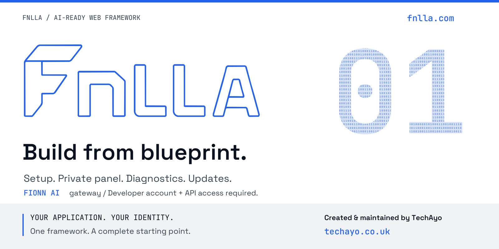
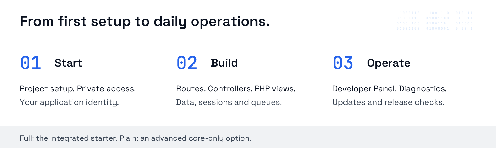
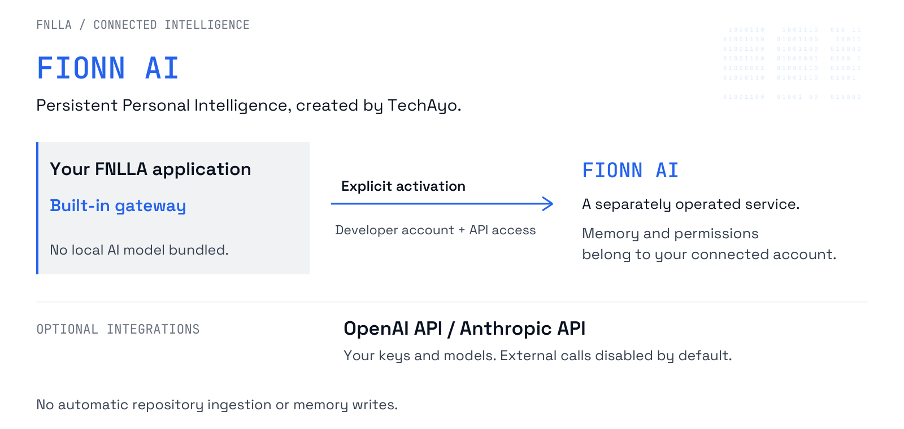

# FNLLA

[](https://fnlla.com)

[](./VERSION)
[](./LICENSE.md)
[](./docs/RELEASE-AND-OPERATIONS.md#performance-baselines-and-budgets)
[](./docs/BUILDING-WITH-FNLLA.md)
[](https://github.com/techayoDEV/fnlla/actions/workflows/fnlla-release-gate.yml?query=branch%3Amain)
[](./public/vendor/fnlla-runtime/README.md)

**Web framework. PHP foundation. Developer tools built in.**

Build from blueprint. FNLLA brings application foundations, Project Setup and a
private Developer Panel into one maintained stack. Spend less time connecting
the basics: routing, data access, diagnostics, previews and update tooling are
already part of the integrated starter. Your application keeps its own identity.

**Build with continuity.** Connect **FIONN AI, Persistent Personal Intelligence
created by TechAyo**, through the built-in gateway. An appropriate FIONN developer
account and API access are required; memory and permissions belong to the connected
service, not the framework. **OpenAI API** and **Anthropic API** are additional,
optional text-generation integrations requiring your model and API key.
External calls are disabled by default. FNLLA does not bundle a language model or
make application decisions autonomously. See the [AI contract](./docs/AI-CONTEXT.md).

Created & maintained by **TechAyo** ([`techayo.co.uk`](https://techayo.co.uk)).
Contact: [`hello@techayo.co.uk`](mailto:hello@techayo.co.uk). Code is MIT licensed.
Lead Developer / Product Manager - **Marcin Kordyaczny**. The name comes from
Finella Gardens, Dundee, Scotland, where the idea originated and FNLLA was first written.

Official framework website: [`fnlla.com`](https://fnlla.com).
Official source repository: [techayoDEV/fnlla](https://github.com/techayoDEV/fnlla).

## What Matters

- **Integrated framework, not a finished application:** this repository is the
  framework source and project-export base. Product code belongs in the
  exported project.
- **Server-rendered PHP:** routes, controllers and plain PHP views are the
  normal development path.
- **Developer Operations Panel:** the private panel is the technical control
  centre for setup, preview, maintenance, customer review, operations,
  analytics, audit, release-readiness and framework updates.
- **AI on your terms:** a dedicated FIONN AI gateway by TechAyo and optional
  OpenAI API / Anthropic API adapters. No local AI model is bundled.
  Project files and sessions are never implicitly sent to cloud providers.
- **Integrated UI runtime:** `public/vendor/fnlla-runtime/` is part of the
  official stack and should stay the shared UI foundation.
- **Application foundations:** FNLLA includes routing, middleware, auth
  foundations, CSRF, sessions, MySQL access, migrations, queue primitives,
  health checks, maintenance preview, security audit, performance budget and
  release operations.
- **Verified exports:** `project:acceptance` checks a generated
  project base before business-specific code is added.

## Start A Real Project



```bash
php fnlla make:project ../my-product "My Product"
cd ../my-product
php fnlla project:claim --product "My Product" --owner "Owner" --developer "Developer"
php fnlla project:acceptance --json
php scripts/test.php
php scripts/lint.php
```

Then initialize a separate Git repository in the exported project and build the
real website or application there. Do not build commercial product code inside
`techayoDEV/fnlla`.

Read the full workflow in
[`docs/STARTING-A-NEW-PROJECT.md`](./docs/STARTING-A-NEW-PROJECT.md).

## Connected Intelligence

[](./docs/AI-CONTEXT.md)

The gateway does not automatically ingest your repository or write service
memory. FIONN AI memory depends on the connected account and its permissions.
For configuration, request boundaries and provider controls, read the
[AI integration contract](./docs/AI-CONTEXT.md).

## Essential Commands

Developer tooling and architecture: [Framework development](docs/ARCHITECTURE-ROADMAP.md).
After `composer install`, use `composer test:unit` for PHPUnit and `composer analyse`
for PHPStan level 5. `php scripts/test.php` remains the dependency-free smoke runner.

```bash
php fnlla list
php fnlla doctor
php fnlla project:acceptance --json
php fnlla security:audit --strict
php fnlla ops:backup-plan --verify
php fnlla app:map --json
php fnlla tech-debt:update --check
php fnlla perf:profile --iterations=5
php fnlla perf:budget --iterations=5 --max-regression=20 --max-regression-ms=1000
php fnlla release:prepare --major --target=2.2.0
```

Command responsibilities, downstream script boundaries and recovery operations
are documented in [`docs/RELEASE-AND-OPERATIONS.md`](./docs/RELEASE-AND-OPERATIONS.md).

## Documentation

Start with [`docs/README.md`](./docs/README.md). It links the full
documentation set:

- [`docs/BUILDING-WITH-FNLLA.md`](./docs/BUILDING-WITH-FNLLA.md) for the
  practical build guide.
- [`docs/PUBLIC-API.md`](./docs/PUBLIC-API.md) for the stable public contract.
- [`docs/RELEASE-AND-OPERATIONS.md`](./docs/RELEASE-AND-OPERATIONS.md) for
  releases, root file policy, production gates, performance budgets, backups,
  restore flow, SBOM and GitHub Actions.
- [`docs/DEVELOPER-PANEL.md`](./docs/DEVELOPER-PANEL.md) for the private
  technical workspace, security, analytics, remote-control adapter
  contract, storage, diagnostics, recovery, technical debt and
  framework-vs-product boundary.
- [`docs/ENVIRONMENT.md`](./docs/ENVIRONMENT.md) for `.env.example`,
  `.env.full.example`, client preview and the FIONN AI bridge boundary.
- [`docs/BUSINESS-APP-REFERENCE.md`](./docs/BUSINESS-APP-REFERENCE.md) for the
  reference business-application checklist.
- [`resources/business-reference/`](./resources/business-reference/) for
  the machine-readable blueprint behind the reference checklist.
- [`docs/AI-CONTEXT.md`](./docs/AI-CONTEXT.md) for local, redacted AI review
  packs and the opt-in FIONN AI bridge contract.

The repository maintains Markdown documentation. A new documentation website
is planned for [fnlla.com](https://fnlla.com); no HTML documentation site or
local `/docs` endpoint is bundled. Validate the current reference with:

```bash
php scripts/check-docs.php
```

## Repository Shape

- `bootstrap/` - application bootstrap and runtime wiring.
- `config/` - environment-driven framework configuration.
- `database/` - migrations, seeders and factories.
- `docs/` - maintained Markdown guides and public API reference.
- `public/` - HTTP entrypoints, project assets and integrated UI runtime.
- `resources/` - local runtime bundles, reference manifests and export
  templates.
- `routes/` - web, maintenance and console route definitions.
- `scripts/` - validation, release and maintainer scripts; Windows shortcuts
  are kept under `scripts/windows/`.
- `src/` - framework source code.
- `storage/` - runtime state; only placeholder `.gitignore` files belong in Git.
- `tests/` - framework and export regression tests.
- `views/` - server-rendered PHP templates.

## Release State

Current source candidate: **2.2.0**. Last public release: **2.1.3**.

The next stable target is **2.2.0**, currently unreleased. Matching source/runtime
version markers identify the candidate, not completed publication acceptance.
Historical CI results do not validate the current candidate. See
[modernization status](./docs/MODERNIZATION-STATUS.md) for outstanding acceptance
and [release operations](./docs/RELEASE-AND-OPERATIONS.md) for publication gates.

See [`CHANGELOG.md`](./CHANGELOG.md) and
[`docs/MIGRATION.md`](./docs/MIGRATION.md) for consolidated upgrade guidance.

## Governance

- License: [`LICENSE.md`](./LICENSE.md)
- Support boundary: [`docs/framework/SUPPORT.md`](./docs/framework/SUPPORT.md)
- Security policy: [`SECURITY.md`](./SECURITY.md)
- Code of conduct: [`.github/CODE_OF_CONDUCT.md`](./.github/CODE_OF_CONDUCT.md)
- Trademark notice: [`docs/framework/TRADEMARKS.md`](./docs/framework/TRADEMARKS.md)
